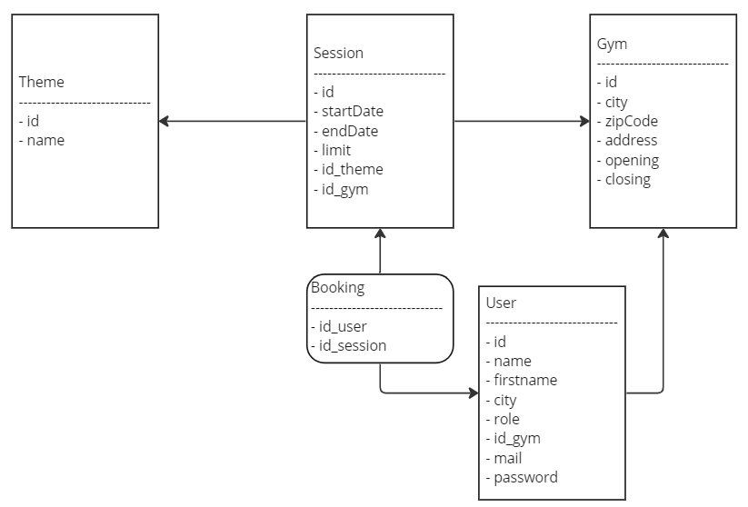
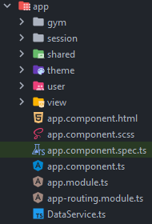
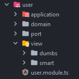
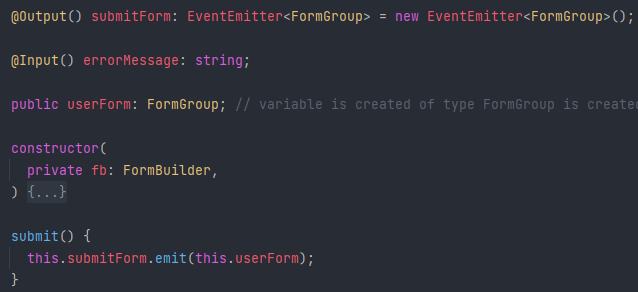
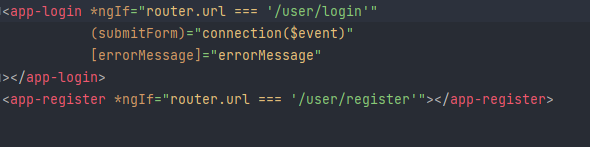
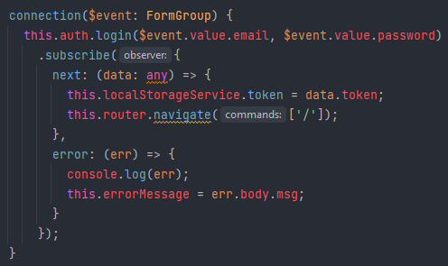
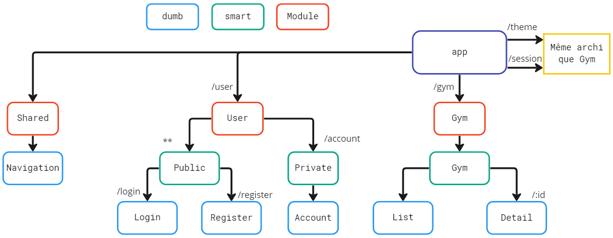

# SportResa

## Bilan de la réalisation

Par manque de temps, la création d'un compte n'a pas pu être faite, pour tester la connexion et les accès au compte, un compte admin est dispo avec ces identifiants : admin@admin / admin (d'autres utilisateurs existent, cf. [DataService](src/app/DataService.ts))

L'application n'étant pas exhaustive, nous n'avons pas réalisé de tests de performances pertinents, voir le fichier [main.ts](src/main.ts) pour l'activation des outils.

Le module thème n'a pas été réalisé, la réservation non plus.

Il est possible de consulter les salles de sports, les détails, de consulter une séance disponible pour cette salle.

Il est aussi possible de consulter son compte et ses informations d'utilisateur.

## Lancement

Pour lancer le serveur en mode dev, utilisez la commande `npm run start`.

## Documentation
### Schéma de modèle de données

### Architecture modulaire et hexagonale

L'application suit une architecture en module typique d'Angular. Chaque module implémente une architecture hexagonale, on a donc un module pour chaque `domain`.

Un module `shared` (appelé `interactor` dans le TP, le nom shared est plus facile à assimiler) existe et comporte les services et vues communes à plusieurs modules (comme les guards ou le service du localStorage).

Ce choix d'architecture permet de développer des modules autonomes et indépendants des autres. De cette manière, on peut gérer les droits dans chaque module uniquement avec un service du module `shared` (permettant de récupérer l'utilisateur connecté).  

Il permet aussi de plus facilement changer une technologie sans impacter toute la logique métier de notre application.

En suivant ces principes, nous avons créé un module pour chaque `domain` de notre application :

Voici un exemple d'architecture hexagonale :

Dans le dossier `port`, on retrouvera les interfaces des services (conservés dans `application`) permettant de manipuler le domain.

### Pattern smart/dumb

Dans les dossiers `views`, on retrouve un dossier `smart` et un dossier `dumb`.

Les 'smart components' sont les composants "métiers" qui se chargeront d'afficher les 'dumb components'. C'est à l'intérieur que l'on retrouvera l'intelligence, c'est-à-dire que le composant 'dumb' ne fera rien d'autres que ce qu'on lui dit de faire ; afficher des données ou remonter des évènements (clique de l'utilisateur).
De ce fait, ce sont les 'smart components' qui se chargeront d'afficher et gérer les 'dumb components'.

Un exemple par le code avec la connexion utilisateur, depuis le clique sur le bouton de connexion :

`login.component.html` :

`login.component.ts` :

`public.component.html` :

`public.component.ts` :

Comme on le voit dans cet exemple, le login component (dumb) sert d'interface entre l'utilisateur et le public component (smart), il remonte les informations et ne possède aucune intelligence.
C'est le public component qui fera la connexion.

### Routage et hiérarchie de composants

Chaque module possède un système de route basé sur le domain qu'il contient :

On note sur ce schéma la hiérarchie des composants avec l'application du pattern smart/dumb.
